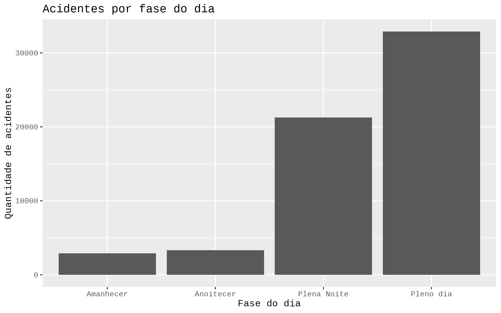
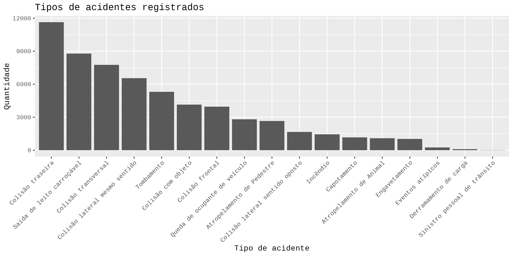

# Análise de Dados de Acidentes de Trânsito – DETRAN 2024

## Descrição do Projeto
Análise de dados de acidentes de trânsito no Brasil utilizando **R**. O projeto explora padrões de acidentes, fatores que influenciam sua ocorrência e aplica conceitos estatísticos como probabilidade, teste qui-quadrado e correlação.

---

## Tecnologias Utilizadas
- **R** – Linguagem de programação.  
- **RStudio / Google Colab** – Ambiente para rodar o notebook.  
- **Pacotes R:** `dplyr`, `ggplot2`.  

---

## Principais Insights

### Fase do Dia


### Tipos de Acidentes


- **Fase do dia:** maior quantidade de acidentes ocorre durante o período diurno.  
- **Tipos de acidentes:** colisões traseiras, laterais e saídas de pista são os mais frequentes.

### Teste Qui-Quadrado
- Relação entre condição meteorológica e tipo de acidente: **p < 0,05**, indicando relação estatística significativa.

### Intervalo de Confiança
- Média de veículos envolvidos: ~1,99 por acidente.  
- Intervalo de confiança 95%: 1,986 – 2,004 veículos.

### Correlação
- Correlação entre número de veículos e feridos: 0,061 (muito fraca).  
- Sugere que outros fatores influenciam mais a gravidade dos acidentes.

---

## Como Rodar o Projeto
1. Abra o notebook `Notebooks/Analise_Acidentes.ipynb` no **Google Colab** ou **RStudio**.  
2. Instale os pacotes necessários:  
```r
install.packages("dplyr")
install.packages("ggplot2")
